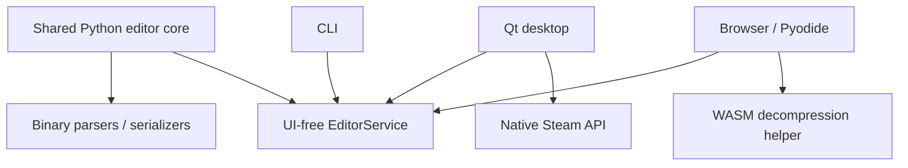

<p align="center">
  
</p>

<p align="center">
  
  
  
  
  
</p>

# S.T.A.L.K.E.R. Save Editor — engineering showcase

A cross-platform save editor built around one shared Python format core, exposed through **desktop UI, CLI and browser runtime**.

This is the public engineering showcase; the implementation repository remains private.

## The interesting part

The application is not three editors. It is **one parsing/editing core** with multiple front ends.



## Engineering highlights

- Python parsing and editing core shared across interfaces.
- Desktop UI with Qt.
- CLI for inspection/research and batch operations.
- Browser build running the Python core through Pyodide.
- WebAssembly/native helper boundary for decompression.
- Binary container parsing, CRC safeguards and round-trip verification.
- Immutable preview before write/export.
- Native Steam Cloud integration through `ctypes`.
- Linux and Windows packaging with PyInstaller.
- Packaged-build diagnostics in CI.

## Supported product families

The private implementation contains registered support for S.T.A.L.K.E.R. 2 and the original PC trilogy, with format-specific capability checks rather than assuming every save has the same structure.

Unknown or unsupported structures fail closed instead of being blindly rewritten.

## Safety model for binary editing

```text
read
 ↓
identify format
 ↓
parse known structures
 ↓
stage changes
 ↓
immutable preview
 ↓
rebuild + safeguards
 ↓
round-trip verification
 ↓
write NEW copy
```

## Browser architecture

The web build processes the selected save locally in the browser. The Python source bundle is executed through Pyodide and native decompression work is provided through a WebAssembly boundary.

A live web build of the private project is available at:

**https://stalker-save-editor.pages.dev**

## Repository map

- [Architecture](docs/ARCHITECTURE.md)
- [Binary-editing principles](docs/BINARY_SAFETY.md)
- [Sanitised parser example](examples/container-parser.py)

## Source availability

The complete parser, serializers, Steam integration and packaging configuration remain in the private implementation repository.
