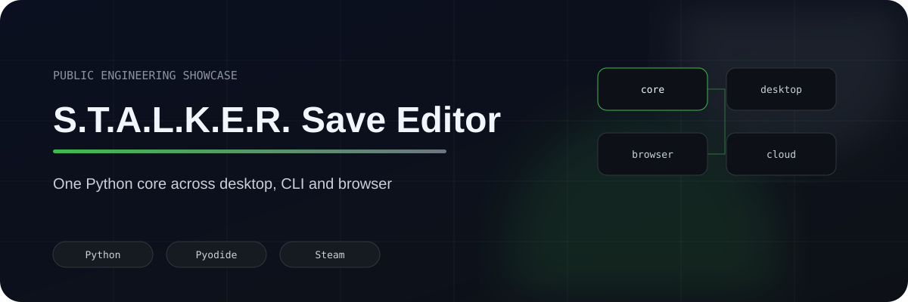
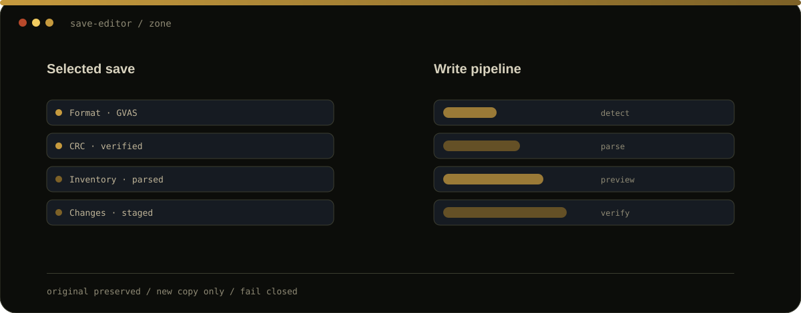

  
  
  
  
  

# S.T.A.L.K.E.R. Save Editor

A tool I built because game-save editing becomes much more interesting once the file stops being JSON.

One Python editing core. Three front ends. Native boundaries where Python alone is not enough.

  <a href="https://stalker-save-editor.pages.dev"><b>▶ Open the browser build</b></a>

  

## <code>01 / one_core_three_surfaces</code>

<table>
<tr>
<td width="33%" valign="top">

### Desktop

Qt UI, local save discovery, backups, export and Steam integration.

</td>
<td width="33%" valign="top">

### CLI

Inspection, research and batch-edit workflows without UI coupling.

</td>
<td width="33%" valign="top">

### Browser

The same Python core running through Pyodide with local file processing.

</td>
</tr>
</table>

## <code>02 / architecture</code>

~~~mermaid
flowchart TB
    CORE[Python format / edit core]
    SERVICE[UI-free EditorService]
    REG[Format registry]
    QT[Qt desktop]
    CLI[CLI]
    WEB[Pyodide browser]
    STEAM[Native Steam API]
    WASM[WASM decompression]

    QT --> SERVICE
    CLI --> SERVICE
    WEB --> SERVICE

    SERVICE --> CORE
    CORE --> REG

    QT --> STEAM
    WEB --> WASM
~~~

## <code>03 / safe_binary_editing</code>

~~~text
identify format
   ↓
parse only known structures
   ↓
stage mutation
   ↓
preview
   ↓
rebuild framing / checksums
   ↓
round-trip verify
   ↓
write a NEW copy
~~~

> If I cannot prove how to rewrite a structure safely, the editor should refuse the edit.

That is much better than producing a save that only *looks* valid.

## <code>04 / hard_parts</code>

| Problem | Approach |
|---|---|
| multiple game/container families | explicit format registry |
| unknown binary fields | keep opaque / read-only |
| native Steam dependency | isolated ctypes boundary |
| browser vs desktop | shared Python core through Pyodide |
| native decompression | isolated WASM/native helper |
| corruption risk | preview + checksum/framing + round-trip verification |
| distribution | PyInstaller Linux/Windows builds + packaged diagnostics |

## <code>05 / supported_direction</code>

The private implementation contains registered handling for:

- S.T.A.L.K.E.R. 2
- Shadow of Chornobyl
- Clear Sky
- Call of Pripyat

Compatibility is capability-based; visually similar versions are not assumed to share a binary format.

## <code>06 / technical_proof</code>

- [Architecture](docs/ARCHITECTURE.md)
- [Binary-editing safety](docs/BINARY_SAFETY.md)
- [Sanitised parser example](examples/container-parser.py)
- [Live browser build](https://stalker-save-editor.pages.dev)

<b>Why the implementation stays private</b>

The complete parser, serializers, Steam integration, packaging setup and research notes remain in the private source repository.

