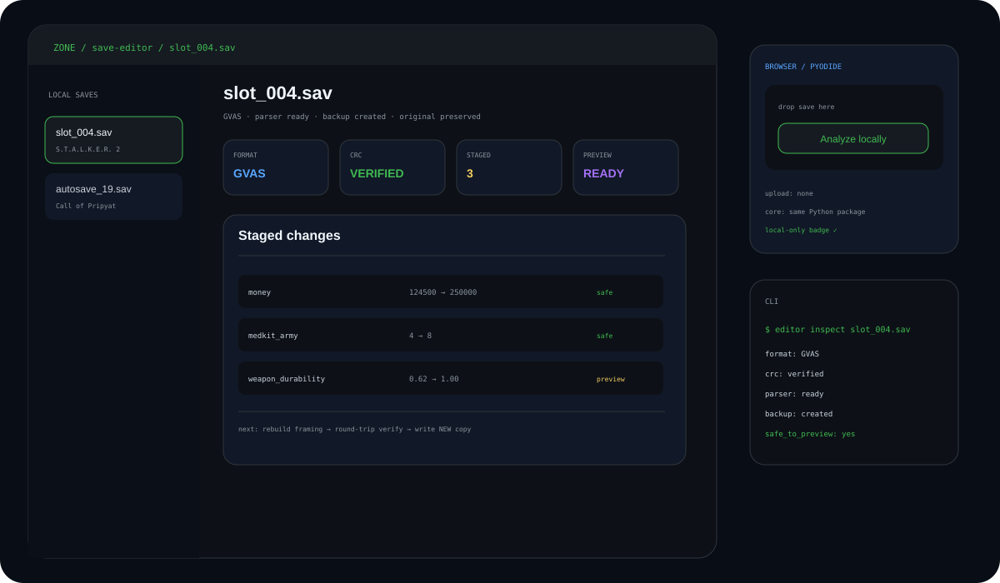
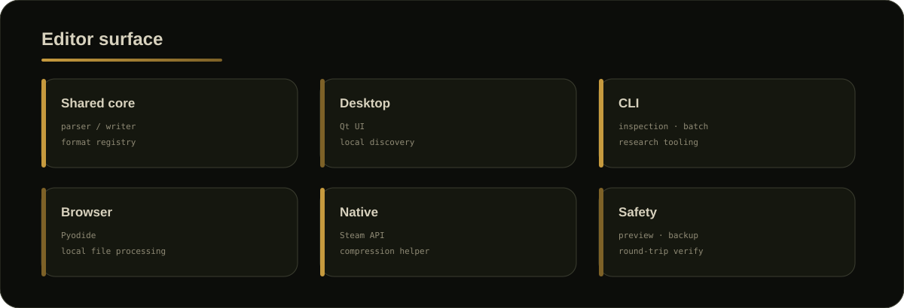
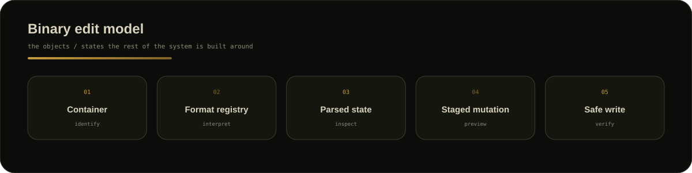
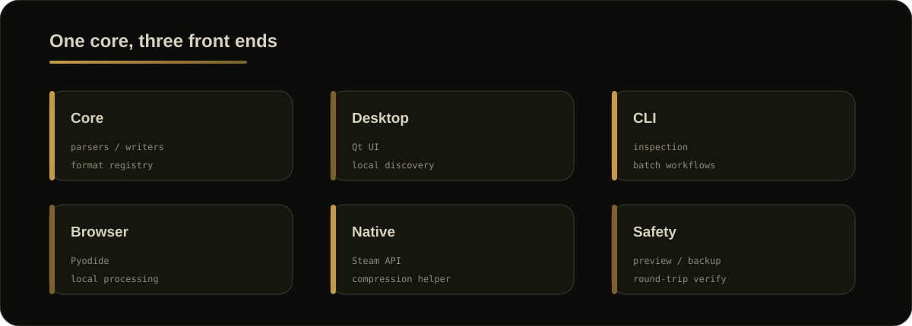
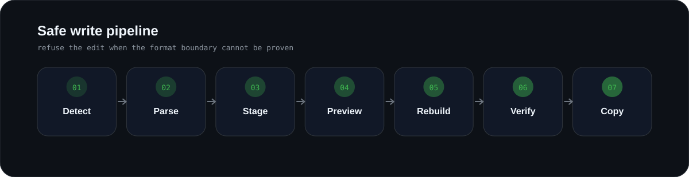
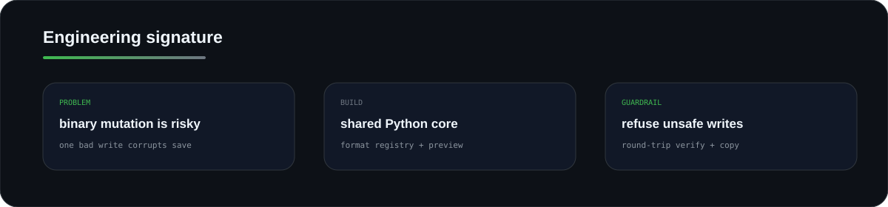

  
  
  
  
  

# S.T.A.L.K.E.R. Save Editor

A tool I built because save editing gets interesting when the file stops being JSON.

**One Python core. Desktop, CLI and browser. Native boundaries where Python alone is not enough.**

<a href="https://stalker-save-editor.pages.dev"><b>▶ Open the browser build</b></a>

## <code>01 / editor_surface</code>

## <code>02 / core_model</code>

## <code>03 / architecture</code>

## <code>04 / safe_write_pipeline</code>

> If I cannot prove how to rewrite a structure safely, the editor should refuse the edit.

## <code>05 / hard_parts</code>

| Problem | Approach |
|---|---|
| multiple container families | explicit format registry |
| unknown binary fields | opaque / read-only |
| native Steam dependency | isolated ctypes boundary |
| browser vs desktop | shared Python core through Pyodide |
| native decompression | isolated WASM/native helper |
| corruption risk | preview + framing/checksum + round-trip verification |
| distribution | PyInstaller builds + packaged diagnostics |

## <code>06 / engineering_signature</code>

  

## <code>07 / inspect</code>

- [Architecture](docs/ARCHITECTURE.md)
- [Binary-editing safety](docs/BINARY_SAFETY.md)
- [Sanitised parser example](examples/container-parser.py)
- [Live browser build](https://stalker-save-editor.pages.dev)

<b>Why the implementation stays private</b>

The complete parser, serializers, Steam integration, packaging setup and research notes remain in the private source repository.

