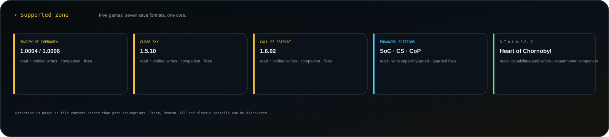
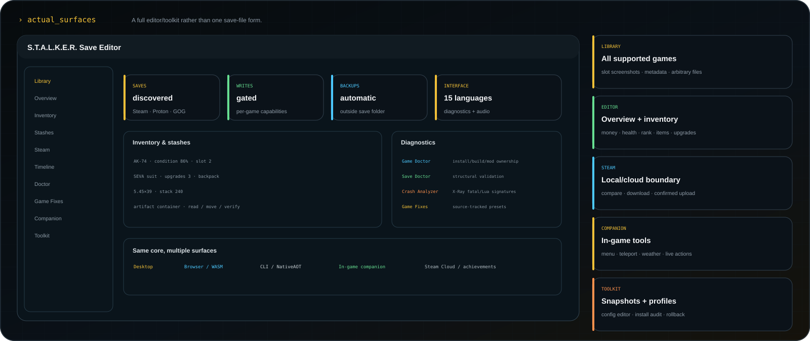
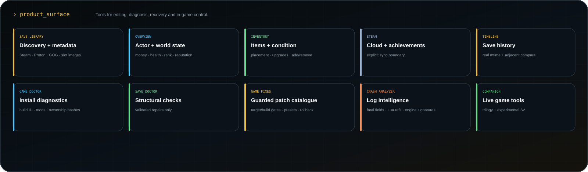
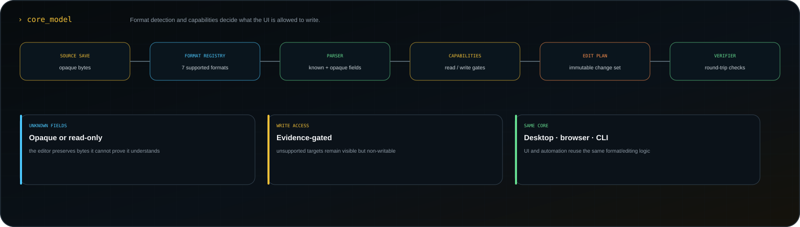
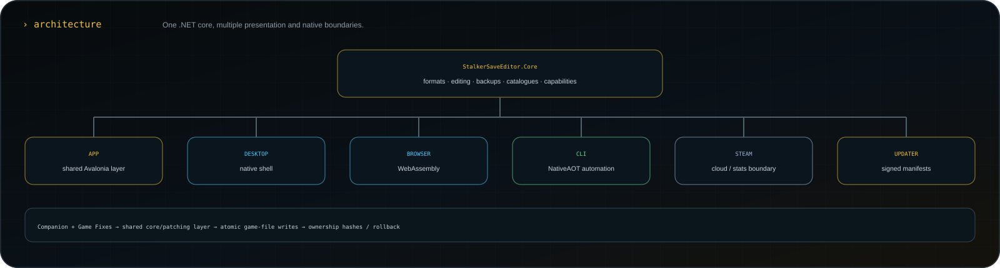
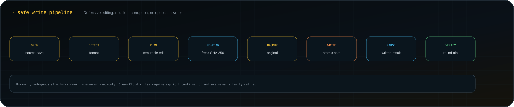
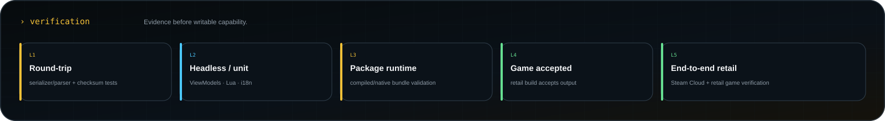

  <a href="https://github.com/Dmitriy-DE/S.T.A.L.K.E.R.-Save-Editor"><b>Source repository</b></a>
  ·
  <a href="https://github.com/Dmitriy-DE/S.T.A.L.K.E.R.-Save-Editor/releases/latest"><b>Latest release</b></a>
  ·
  <a href="https://stalker-save-editor.pages.dev"><b>Browser build</b></a>

  
  
  
  
  

# S.T.A.L.K.E.R. Save Editor

This repository is the **visual engineering showcase** for the public open-source project.

The full source code, releases, installation instructions, issue tracker and detailed documentation live in:

### → [Dmitriy-DE/S.T.A.L.K.E.R.-Save-Editor](https://github.com/Dmitriy-DE/S.T.A.L.K.E.R.-Save-Editor)

The project is now a cross-platform **.NET 10** save editor and game toolkit for the S.T.A.L.K.E.R. series — not the old Python/Qt prototype that this showcase previously described.

> **Editing rule:** if the project cannot prove how to rewrite a structure safely, it stays read-only.

## <code>01 / supported_zone</code>

The same core understands seven save formats across the original trilogy, Enhanced Editions and S.T.A.L.K.E.R. 2. Detection is based on file content rather than path assumptions.

## <code>02 / actual_surfaces</code>

This is no longer just a binary editor. The project includes save discovery, inventory/stash editing, Steam Cloud and achievements, Save Timeline, Game Doctor, Save Doctor, Crash Analyzer, guarded Game Fixes, Toolkit snapshots/profiles and in-game companion tooling.

## <code>03 / product_surface</code>

## <code>04 / core_model</code>

Unknown structures are preserved as opaque/read-only data. Writable capabilities are exposed only where the format target has enough evidence for safe mutation.

## <code>05 / architecture</code>

The solution separates Core, shared Avalonia application logic, Desktop, Browser/WASM, CLI/NativeAOT, Steam and Updater boundaries while reusing the same format/editing core.

## <code>06 / safe_write_pipeline</code>

Every supported write is prepared, re-hashed, backed up, written through the guarded storage path and parsed/verified again. Unsupported or ambiguous structures fail closed.

## <code>07 / verification</code>

The project tracks verification from synthetic round-trip tests through compiled package validation to retail-game and Steam Cloud evidence.

## <code>08 / inspect_the_real_project</code>

- [Main source repository](https://github.com/Dmitriy-DE/S.T.A.L.K.E.R.-Save-Editor)
- [Latest releases](https://github.com/Dmitriy-DE/S.T.A.L.K.E.R.-Save-Editor/releases/latest)
- [Architecture](https://github.com/Dmitriy-DE/S.T.A.L.K.E.R.-Save-Editor/blob/main/ARCHITECTURE.md)
- [Game Fixes](https://github.com/Dmitriy-DE/S.T.A.L.K.E.R.-Save-Editor/blob/main/docs/GAME_FIXES.md)
- [Game / Save Doctor & Crash Analyzer](https://github.com/Dmitriy-DE/S.T.A.L.K.E.R.-Save-Editor/blob/main/docs/GAME_DOCTOR.md)
- [Companion protocol](https://github.com/Dmitriy-DE/S.T.A.L.K.E.R.-Save-Editor/blob/main/docs/MOD_COMPANION_PROTOCOL.md)
- [Packaging](https://github.com/Dmitriy-DE/S.T.A.L.K.E.R.-Save-Editor/blob/main/docs/PACKAGING.md)
- [Browser build](https://stalker-save-editor.pages.dev)

S.T.A.L.K.E.R. is a trademark of its respective owner. This project is an independent community tool and is not affiliated with or endorsed by GSC Game World.
