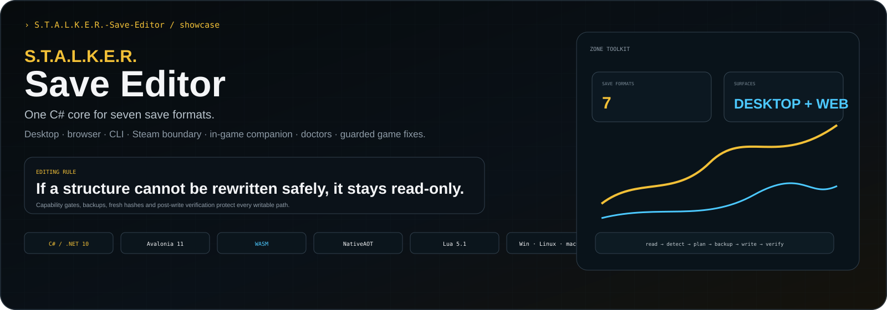
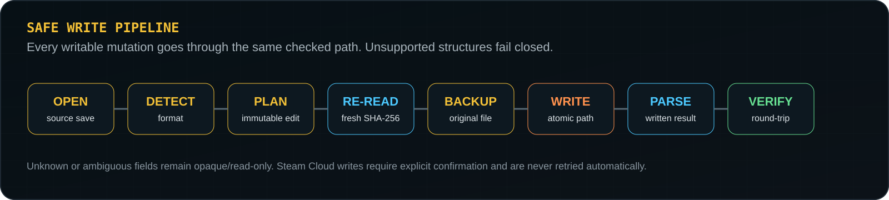
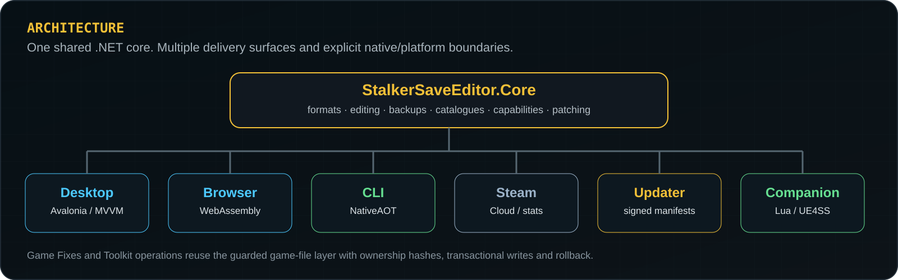
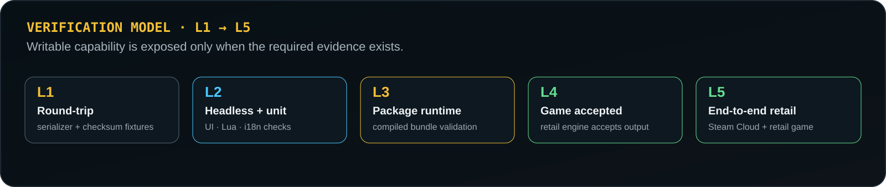

  

  
  
  

> **A cross-platform save editor and game toolkit for the full S.T.A.L.K.E.R. series.**  
> The rule is simple: **if the project cannot prove how to rewrite a structure safely, it stays read-only.**

<table>
<tr>
<td align="center"><b>7</b> save formats</td>
<td align="center"><b>.NET 10</b> shared core</td>
<td align="center"><b>Desktop</b> Avalonia 11</td>
<td align="center"><b>Browser</b> WebAssembly</td>
<td align="center"><b>CLI</b> NativeAOT</td>
<td align="center"><b>15</b> UI languages</td>
</tr>
</table>

## The editor

  

<table>
<tr>
<td width="33%" valign="top"><b>🗂 Library & inspection</b> Find saves across Steam, Proton, GOG and disc installs. Read metadata, game slot screenshots, world state and compare saves/backups.</td>
<td width="33%" valign="top"><b>🎒 Inventory & stashes</b> Edit money, stacks, condition, placement and upgrades; add/remove catalogue items; work with stashes, factions and safe level changer points.</td>
<td width="33%" valign="top"><b>☁️ Steam boundary</b> Compare local/cloud saves, download or explicitly upload, inspect and toggle achievements. Cloud writes are never silently retried.</td>
</tr>
<tr>
<td valign="top"><b>🩺 Doctors & diagnostics</b> Game Doctor, Save Doctor and Crash Analyzer inspect installs, saves, quest rules, logs, ownership hashes and unknown states without guessing.</td>
<td valign="top"><b>🛠 Game Fixes & Toolkit</b> Source-tracked fix catalogue, guarded presets, transactional install/remove, snapshots, profiles, config editing and rollback ownership.</td>
<td valign="top"><b>🎮 Companion</b> In-game tooling for the trilogy plus experimental S.T.A.L.K.E.R. 2 companion: teleport, weather, live actions and item tooling through explicit protocols.</td>
</tr>
</table>

## Supported zone

| Game | Read | Write | Extra tooling |
|---|:---:|:---:|---|
| **Shadow of Chernobyl 1.0004 / 1.0006** | ✅ | ✅ | Companion · Game Fixes · Doctors |
| **Clear Sky 1.5.10** | ✅ | ✅ | Companion · Game Fixes · Doctors |
| **Call of Pripyat 1.6.02** | ✅ | ✅ | Companion · Game Fixes · Doctors |
| **Enhanced Editions — SoC / CS / CoP** | ✅ | capability-gated | Game Fixes · Doctors |
| **S.T.A.L.K.E.R. 2: Heart of Chornobyl** | ✅ | capability-gated | Doctors · experimental companion |

Detection is based on file content rather than path assumptions. Unsupported/unknown structures remain visible but are not made writable.

## Compare & inspect

  

<table>
<tr>
<td width="25%" valign="top"><b>Library</b> all discovered saves, newest first</td>
<td width="25%" valign="top"><b>Overview</b> money · health · rank · reputation · date</td>
<td width="25%" valign="top"><b>Timeline</b> real mtime ordering and adjacent comparison</td>
<td width="25%" valign="top"><b>Encyclopedia</b> installed-game catalogue with item actions</td>
</tr>
</table>

## Safe writes

<table>
<tr>
<td width="33%" valign="top"><b>Fail closed</b> Unknown or ambiguous fields stay opaque/read-only instead of receiving guessed meanings.</td>
<td width="33%" valign="top"><b>Backup first</b> The original is preserved outside the save folder before any supported mutation is committed.</td>
<td width="33%" valign="top"><b>Verify after write</b> The result is parsed again and round-trip validated before the operation is treated as successful.</td>
</tr>
</table>

## Architecture

<table>
<tr>
<td width="33%" valign="top"><b>Shared core</b> Formats, capabilities, editing, backups, catalogues and patching live in one reusable .NET layer.</td>
<td width="33%" valign="top"><b>Explicit boundaries</b> Steam, updater and companion concerns do not leak into the save-format core.</td>
<td width="33%" valign="top"><b>Same logic, several surfaces</b> Desktop, browser and CLI reuse the same format/editing model instead of reimplementing rules.</td>
</tr>
</table>

## Verification

<table>
<tr>
<td width="50%" valign="top">
<b>Writable capability is evidence-driven.</b>  
L1–L3 cover synthetic round-trips, headless/UI checks and packaged-runtime validation. L4–L5 require actual retail-game acceptance and end-to-end Steam/game evidence.
</td>
<td width="50%" valign="top">
<b>Installed-game mutation is guarded separately.</b>  
Game Fixes and Toolkit actions use target/build gates, ownership hashes, transactional writes, snapshots and rollback state. Unknown loose files stay unknown.
</td>
</tr>
</table>

## Get it

<table>
<tr>
<td width="33%" align="center"><b>Source</b> <a href="https://github.com/Dmitriy-DE/S.T.A.L.K.E.R.-Save-Editor">github.com/Dmitriy-DE/S.T.A.L.K.E.R.-Save-Editor</a></td>
<td width="33%" align="center"><b>Desktop builds</b> <a href="https://github.com/Dmitriy-DE/S.T.A.L.K.E.R.-Save-Editor/releases/latest">Windows · Linux · macOS</a></td>
<td width="33%" align="center"><b>Browser build</b> <a href="https://stalker-save-editor.pages.dev">stalker-save-editor.pages.dev</a></td>
</tr>
</table>

<b>Documentation</b>

- [Architecture](https://github.com/Dmitriy-DE/S.T.A.L.K.E.R.-Save-Editor/blob/main/ARCHITECTURE.md)
- [Project state / roadmap](https://github.com/Dmitriy-DE/S.T.A.L.K.E.R.-Save-Editor/blob/main/docs/roadmap/STATE.md)
- [Reliability levels](https://github.com/Dmitriy-DE/S.T.A.L.K.E.R.-Save-Editor/blob/main/docs/roadmap/RL-reliability.md)
- [Companion](https://github.com/Dmitriy-DE/S.T.A.L.K.E.R.-Save-Editor/blob/main/docs/COMPANION.md)
- [Companion protocol](https://github.com/Dmitriy-DE/S.T.A.L.K.E.R.-Save-Editor/blob/main/docs/MOD_COMPANION_PROTOCOL.md)
- [Game Fixes](https://github.com/Dmitriy-DE/S.T.A.L.K.E.R.-Save-Editor/blob/main/docs/GAME_FIXES.md)
- [Game / Save Doctor & Crash Analyzer](https://github.com/Dmitriy-DE/S.T.A.L.K.E.R.-Save-Editor/blob/main/docs/GAME_DOCTOR.md)
- [Profiles / snapshots / rollback](https://github.com/Dmitriy-DE/S.T.A.L.K.E.R.-Save-Editor/blob/main/docs/PROFILES.md)
- [Packaging](https://github.com/Dmitriy-DE/S.T.A.L.K.E.R.-Save-Editor/blob/main/docs/PACKAGING.md)

S.T.A.L.K.E.R. is a trademark of its respective owner. Independent community project; not affiliated with or endorsed by GSC Game World.
