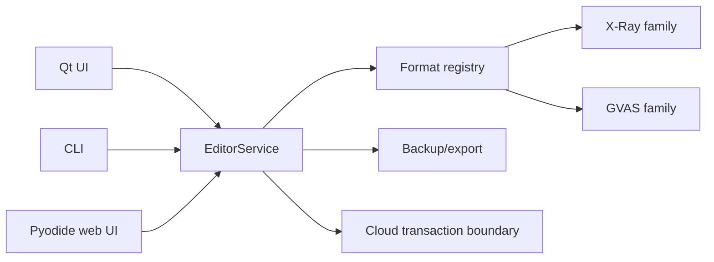

# Architecture

## Shared core

The key architectural constraint is that desktop, CLI and browser must not implement separate editing semantics.

## Format registry

A format is considered supported only when its parser/serializer family and compatibility boundary are explicitly registered.

That avoids a dangerous class of save-editor bugs: assuming that a visually similar game/version uses an identical binary format.

## Native boundaries

Some functionality cannot be replaced by pure Python:

- game-specific compression helpers;
- Steam native API integration.

Those dependencies are isolated behind explicit boundaries so the rest of the editor core remains testable and platform-neutral.
